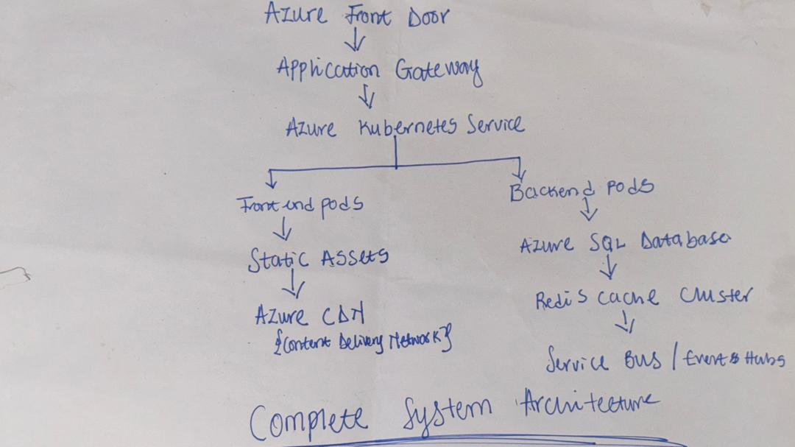

# Step 7: Azure Cloud Architecture Design

The proposed architecture leverages Azure's enterprise services to deliver a highly available, auto-scaling, and compliant trading platform capable of handling variable trading volumes while maintaining sub-second response times and 99.99% uptime.

---

## Section 1: Azure Fundamentals

### Core Azure Services for Trading Applications

#### **Compute Services**
- **Azure Kubernetes Service (AKS)** - Primary choice for containerized applications
- **Azure App Service** - Alternative for simpler deployment scenarios
- **Azure Container Instances (ACI)** - For batch processing and temporary workloads

#### **Database Services**
- **Azure SQL Database** - Primary transactional database with built-in HA
- **Azure Cache for Redis** - High-performance caching layer
- **Azure Cosmos DB** - Global distribution for reference data

#### **Integration Services**
- **Azure API Management** - API gateway and security
- **Azure Service Bus** - Reliable messaging for trade events
- **Azure Event Hubs** - High-throughput data streaming

#### **Security & Compliance**
- **Azure Active Directory** - Identity and access management
- **Azure Key Vault** - Secrets and certificate management
- **Azure Security Center** - Security monitoring and compliance

### Compute Options Comparison

| Service | Pros | Cons | Best For |
|---------|------|------|----------|
| **AKS** | Full container orchestration, auto-scaling, multi-region | Complex setup, requires K8s expertise | Production trading systems |
| **App Service** | Simple deployment, built-in scaling | Less control, platform limitations | Development/staging environments |
| **ACI** | Serverless containers, pay-per-use | No orchestration, limited networking | Batch jobs, temporary workloads |

**Recommendation**: **Azure Kubernetes Service (AKS)** for production due to:
- Superior auto-scaling capabilities for trading volume spikes
- Multi-region deployment support for global operations
- Advanced networking and security features
- Integration with Azure DevOps for CI/CD

### Resource Organization Strategy

#### **Resource Group Structure**
```
rg-trading-prod-eastus2
├── AKS Cluster (trading-cluster)
├── Azure SQL Database (trading-db)
├── Redis Cache (trading-cache)
├── Key Vault (trading-kv)
├── Container Registry (tradingacr)
└── Application Insights (trading-ai)

rg-trading-networking-eastus2
├── Virtual Network (trading-vnet)
├── Application Gateway (trading-agw)
├── Private DNS Zones
└── Network Security Groups
```

#### **Naming Convention**
- **Format**: `{service}-{app}-{env}-{region}`
- **Example**: `aks-trading-prod-eastus2`
- **Benefits**: Consistent, searchable, environment-specific

---

## Section 2: Architecture Design

### Complete System Architecture





### Detailed Architecture Components

#### **Frontend Tier**
- **React Application** deployed as containers in AKS
- **Azure CDN** for static asset delivery
- **Application Gateway** with WAF for security
- **Azure Front Door** for global traffic management

#### **Backend Tier**
- **Spring Boot Application** in AKS with horizontal pod autoscaling
- **Internal Load Balancer** for pod distribution
- **Private endpoints** for database connectivity
- **Service Mesh** (Istio) for microservice communication

#### **Data Tier**
- **Azure SQL Database** (Business Critical tier) for ACID transactions
- **Read Replicas** in multiple regions for global read access
- **Redis Cache** for session state and frequently accessed data
- **Azure Storage** for audit logs and backup retention

### Database Architecture Decision

#### **Primary Database: Azure SQL Database Business Critical**

**Justification:**
- **ACID Compliance**: Essential for financial transactions
- **Built-in HA**: 99.99% SLA with automatic failover
- **Point-in-time Recovery**: Critical for trade reconciliation
- **Advanced Security**: Always Encrypted, Row-Level Security
- **Compliance**: SOC, ISO 27001, PCI DSS certified

#### **Caching Strategy: Azure Cache for Redis Premium**
- **Session State**: User authentication and preferences  
- **Reference Data**: Currency rates, holiday calendars, counterparties
- **Trade Blotter**: Real-time trade list caching
- **Geographic Replication**: Cross-region cache synchronization

#### **Alternative Considered: Azure Cosmos DB**
- **Rejected for primary database** due to eventual consistency
- **Recommended for**: Reference data global distribution
- **Use case**: Holiday calendars, currency definitions

### Network and Security Architecture

#### **Network Design**
```
Production VNET (10.0.0.0/16)
├── AKS Subnet (10.0.1.0/24)
├── Database Subnet (10.0.2.0/24)
├── Application Gateway Subnet (10.0.3.0/24)
└── Management Subnet (10.0.4.0/24)
```

#### **Security Controls**
- **Network Security Groups**: Subnet-level traffic filtering
- **Private Endpoints**: Database access without public internet
- **Azure Firewall**: Centralized network security
- **DDoS Protection**: Standard tier for all public endpoints
- **Web Application Firewall**: OWASP top 10 protection

---

## Section 3: Deployment Strategy 

### Container Strategy

#### **Azure Container Registry (ACR)**
- **Premium Tier** for geo-replication and vulnerability scanning
- **Private endpoints** for secure image pulls
- **Content trust** with Docker Notary for image integrity
- **Automated image builds** with Azure DevOps integration

#### **Container Images**
```dockerfile
# Production Frontend Image
FROM node:18-alpine AS build
WORKDIR /app
COPY package*.json ./
RUN npm ci --only=production
COPY . .
RUN npm run build

FROM nginx:alpine
COPY --from=build /app/dist /usr/share/nginx/html
COPY nginx.conf /etc/nginx/nginx.conf
EXPOSE 80
```

```dockerfile
# Production Backend Image
FROM maven:3.8.6-openjdk-17 AS build
WORKDIR /app
COPY pom.xml .
RUN mvn dependency:go-offline
COPY src ./src
RUN mvn clean package -DskipTests

FROM openjdk:17-jdk-slim
WORKDIR /app
COPY --from=build /app/target/trading-app.jar app.jar
EXPOSE 8080
ENTRYPOINT ["java", "-jar", "app.jar"]
```

### CI/CD Pipeline Design with Azure DevOps

#### **Pipeline Stages**
1. **Source Control**: Git with branch policies and pull request validation  
2. **Build Stage**: Maven/npm builds with dependency scanning
3. **Test Stage**: Unit tests, integration tests, security scans
4. **Package Stage**: Docker image builds and vulnerability assessment  
5. **Deploy Stage**: Blue-green deployment with health checks

#### **Azure DevOps Pipeline YAML**
```yaml
trigger:
  branches:
    include:
    - main
    - develop

stages:
- stage: Build
  jobs:
  - job: BuildAndTest
    pool:
      vmImage: 'ubuntu-latest'
    steps:
    - task: Maven@3
      inputs:
        mavenPomFile: 'backend/pom.xml'
        goals: 'clean package'
        publishJUnitResults: true
    
    - task: Docker@2
      inputs:
        containerRegistry: 'tradingACR'
        repository: 'trading-backend'
        command: 'buildAndPush'
        Dockerfile: 'backend/Dockerfile'
        tags: '$(Build.BuildId)'

- stage: Deploy
  jobs:
  - deployment: DeployToAKS
    environment: 'trading-prod'
    strategy:
      runOnce:
        deploy:
          steps:
          - task: KubernetesManifest@0
            inputs:
              action: 'deploy'
              kubernetesServiceConnection: 'trading-aks'
              manifests: 'k8s/deployment.yaml'
```

### Scaling and Performance Optimization

#### **Horizontal Pod Autoscaler (HPA)**
```yaml
apiVersion: autoscaling/v2
kind: HorizontalPodAutoscaler
metadata:
  name: trading-backend-hpa
spec:
  scaleTargetRef:
    apiVersion: apps/v1
    kind: Deployment
    name: trading-backend
  minReplicas: 3
  maxReplicas: 50
  metrics:
  - type: Resource
    resource:
      name: cpu
      target:
        type: Utilization
        averageUtilization: 70
  - type: Resource
    resource:
      name: memory
      target:
        type: Utilization
        averageUtilization: 80
```

#### **Performance Optimization Strategies**
- **Database Connection Pooling**: HikariCP with optimal pool sizing
- **Redis Caching**: 99% cache hit ratio for reference data
- **CDN**: Global edge caching for static assets
- **Database Indexing**: Optimized for trade search patterns
- **API Response Caching**: 5-minute TTL for dashboard data

---

## Section 4: Operations and Monitoring 

### Monitoring Strategy with Application Insights

#### **Application Performance Monitoring**
```java
// Backend telemetry configuration
@Component
public class TelemetryConfiguration {
    
    @Bean
    public TelemetryInitializer customTelemetryInitializer() {
        return telemetry -> {
            telemetry.getContext().getOperation().setName("TradingOperation");
            telemetry.getContext().getUser().setId(getCurrentUserId());
        };
    }
}
```

#### **Key Performance Indicators (KPIs)**
- **Response Time**: < 500ms for 95th percentile
- **Availability**: 99.99% uptime (52 minutes downtime/year)
- **Throughput**: 10,000 trades per minute during peak hours
- **Database Performance**: < 100ms query response time
- **Cache Hit Ratio**: > 95% for reference data

#### **Custom Metrics and Alerts**
- **Business Metrics**: Trade volume, settlement failures, P&L calculations
- **Technical Metrics**: Pod CPU/memory, database connections, cache miss rate
- **Alert Thresholds**: CPU > 80%, Memory > 85%, Response time > 1s
- **Alert Channels**: Teams notifications, PagerDuty for critical issues

### Operational Procedures

#### **Incident Response Playbook**
1. **Detection**: Automated alerts via Application Insights
2. **Assessment**: On-call engineer evaluates severity (P1-P4)
3. **Response**: Escalation matrix based on business impact
4. **Resolution**: Automated rollback or hotfix deployment
5. **Post-mortem**: Root cause analysis and process improvement

#### **Deployment Procedures**
- **Blue-Green Deployment**: Zero-downtime deployments
- **Canary Releases**: 5% traffic routing for validation
- **Feature Flags**: Dark launches and gradual rollouts
- **Rollback Strategy**: Automated rollback on health check failures

### Disaster Recovery and Business Continuity

#### **Recovery Time Objectives (RTO)**
- **Critical Systems**: 15 minutes
- **Non-Critical Systems**: 4 hours
- **Data Recovery**: 1 hour (RPO)

#### **Multi-Region Architecture**
```
Primary Region (West Europe)     Secondary Region (East US)
├── AKS Cluster (Active)  -->  ├── AKS Cluster (Standby)
├── SQL Database (Primary) --> ├── SQL Database (Replica)
└── Redis Cache (Primary)  --> └── Redis Cache (Replica)
```

#### **Backup Strategy**
- **Database**: Automated daily backups with 35-day retention
- **Application State**: Redis persistence with AOF
- **Configuration**: Infrastructure as Code in Git
- **Testing**: Monthly DR drills with documented procedures

---

## Section 5: Cost and Governance (10 points)

### Cost Management and Optimization

#### **Estimated Monthly Costs (Production)**
| Service | Configuration | Monthly Cost |
|---------|---------------|--------------|
| AKS | 5 Standard_D4s_v3 nodes | £600 |
| Azure SQL Database | Business Critical, 8 vCores | £2,400 |
| Redis Cache | Premium P3 (26GB) | £800 |
| Application Gateway | WAF v2, 2 instances | £400 |
| Container Registry | Premium with geo-replication | £200 |
| **Total Estimated Cost** | | **£4,400/month** |

#### **Cost Optimization Strategies**
- **Reserved Instances**: 40% savings on compute with 3-year commitment
- **Auto-scaling**: Dynamic scaling based on trading hours (6 AM - 6 PM BST)
- **Dev/Test Pricing**: 55% discount on non-production environments  
- **Storage Tiering**: Automatic archival of audit logs to cool storage
- **Resource Tagging**: Cost allocation by business unit and environment

#### **Budget Controls**
- **Budget Alerts**: 80%, 100%, 120% of monthly allocation
- **Resource Policies**: Prevent oversized VM deployments
- **Cost Analysis**: Weekly reviews with business stakeholders
- **Optimization Recommendations**: Azure Advisor integration

### Governance Framework

#### **Azure Policy Compliance**
```json
{
  "displayName": "Trading App Security Policy",
  "description": "Enforce security standards for trading application",
  "policyRule": {
    "if": {
      "field": "type",
      "equals": "Microsoft.Sql/servers"
    },
    "then": {
      "effect": "deny",
      "details": {
        "type": "Microsoft.Sql/servers/firewallRules",
        "existenceCondition": {
          "field": "Microsoft.Sql/servers/firewallRules/startIpAddress",
          "equals": "0.0.0.0"
        }
      }
    }
  }
}
```

#### **Compliance Considerations**
- **Financial Services Regulations**: SOX, PCI DSS, GDPR compliance
- **Data Residency**: Customer data stored within required geographical boundaries
- **Audit Trails**: Comprehensive logging for regulatory reporting
- **Access Controls**: Role-based access with periodic access reviews
- **Encryption**: Data encrypted at rest and in transit using Azure Key Vault

#### **Resource Management**
- **Naming Standards**: Consistent naming across all resources
- **Tagging Strategy**: Environment, owner, cost-center, compliance tags
- **Resource Locks**: Prevent accidental deletion of critical resources
- **Access Reviews**: Quarterly review of user permissions and service principals

---

## Implementation Planning

### Phase 1: Foundation (Weeks 1-2)
- Set up Azure subscriptions and resource groups
- Configure networking and security baseline
- Establish CI/CD pipelines and container registry

### Phase 2: Core Services (Weeks 3-4)  
- Deploy AKS cluster with monitoring
- Set up Azure SQL Database with high availability
- Configure Redis cache and private endpoints

### Phase 3: Application Deployment (Weeks 5-6)
- Deploy trading application containers
- Configure auto-scaling and load balancing
- Implement blue-green deployment pipeline

### Phase 4: Production Readiness (Weeks 7-8)
- Security hardening and penetration testing
- Disaster recovery testing and documentation
- Performance testing and optimization

### Phase 5: Go-Live and Operations (Week 9+)
- Production deployment with monitoring
- Operational handover and training
- Continuous optimization and cost management

---

## Security and Compliance Framework

### Security Architecture
- **Zero Trust Model**: Verify every user and device
- **Network Segmentation**: Private subnets with NSG rules  
- **Identity Management**: Azure AD with MFA and conditional access
- **Secrets Management**: Azure Key Vault with RBAC
- **Vulnerability Management**: Regular scanning and patch management

### Compliance Alignment
- **SOX Compliance**: Automated controls and audit trails
- **PCI DSS**: Secure card data handling (if applicable)
- **GDPR**: Data protection and privacy controls
- **SOC 2**: Security and availability controls

---

## Conclusion

This Azure cloud architecture provides a robust, scalable, and compliant platform for global trading operations. The design emphasizes:

- **High Availability**: 99.99% uptime with multi-region failover
- **Performance**: Sub-second response times with auto-scaling
- **Security**: Enterprise-grade security with compliance alignment  
- **Cost Efficiency**: Optimized resource utilization with predictable costs
- **Operational Excellence**: Automated deployment and monitoring

The architecture is designed to support the critical nature of financial trading while providing the flexibility to scale with business growth and regulatory changes.

**Total Investment**: £4,400/month for production environment
**Implementation Timeline**: 9 weeks to production readiness
**Business Value**: Reduced operational risk, improved trader productivity, and regulatory compliance assurance

This design positions the trading application for enterprise-scale operations while maintaining the agility needed in fast-moving financial markets.